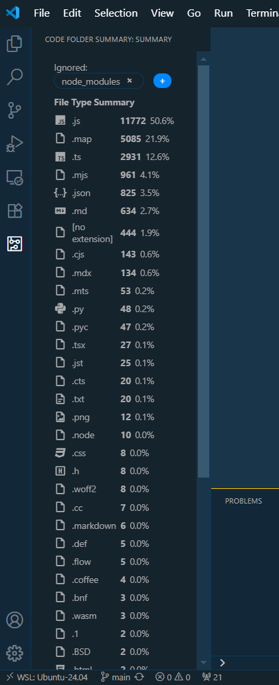

# Code Folder Summary

Code Folder Summary is a Visual Studio Code extension that gives you a quick, beautiful overview of the file types in your project. Instantly see a summary of all file types in your workspace.

## Features

- **Sidebar Summary:** Adds a new sidebar icon ("Code Folder Summary") to the Activity Bar.
- **File Type Overview:** Shows a list of all file types in your workspace, with:
  - Material Design icons for each file type
  - File extension
  - Count of files
  - Percentage of total files
- **Ignore Folders:**
  - Easily ignore folders from the summary using chips at the top of the sidebar.
  - Add or remove ignored folders with a click—your choices are remembered.
- **Theme-Aware UI:**
  - All UI elements (chips, buttons, text) follow your current VS Code theme.
- **No Setup Required:**
  - Works out of the box—just install and open the sidebar!

## How to Use

1. **Open the Sidebar:**
   - Click the "Code Folder Summary" icon in the Activity Bar (left sidebar).
2. **View File Types:**
   - Instantly see a summary of all file types in your workspace, with icons, counts, and percentages.
3. **Ignore Folders:**
   - At the top, see chips for currently ignored folders.
   - Click the "+" button to select folders to ignore from the summary.
   - Remove an ignored folder by clicking the "×" on its chip.
   - Your ignored folders are saved and persist across sessions.

## Example

## Requirements

- No special requirements. Works with any folder/workspace in VS Code.

## Extension Settings

This extension does not add any custom settings at this time.

## Known Issues

- Only top-level folders can be ignored (subfolder support may be added in the future).
- File type detection is based on file extension.

## Release Notes

### 0.2.0
- Refactored for maintainability: logic split into providers, utils, and state folders
- Improved code structure and documentation

### 0.1.0 (previous release)
- Initial release: File type summary, ignore folders, theme-aware UI, Material Icons.

---

**Enjoy using Code Folder Summary!**
